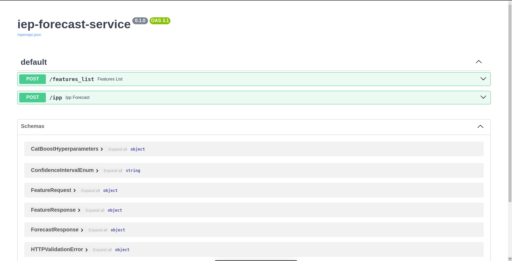

# Сервис для прогнозирования 

API Сервиса написана на FastAPI, запускается на 5051 порте, Dockerfile тут же




### Создание образа
```cmd
docker build -t forecast_service:1.0 .
```

### Запуск контейнера
```cmd 
docker run -p 5051:5051 -d -t forecast_service:1.0
```
