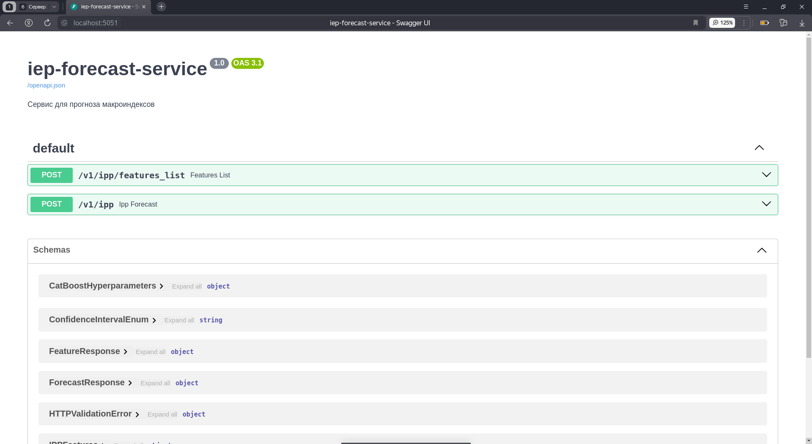

# Сервис для прогнозирования 

API Сервиса написана на FastAPI, запускается на 5051 порте, Dockerfile тут же





### Создание образа
```cmd
docker build -t forecast_service .
```

### Запуск контейнера
```cmd 
docker run \
    --env APP_CORS_ORIGINS_LIST=https://data.vavt.ru,http://data.vavt.ru,http://localhost:3000\
    --env APP_NGINX_PREFIX=/forecast/api\
    forecast_service    
```
